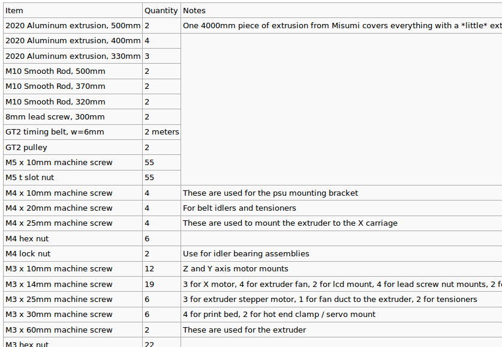
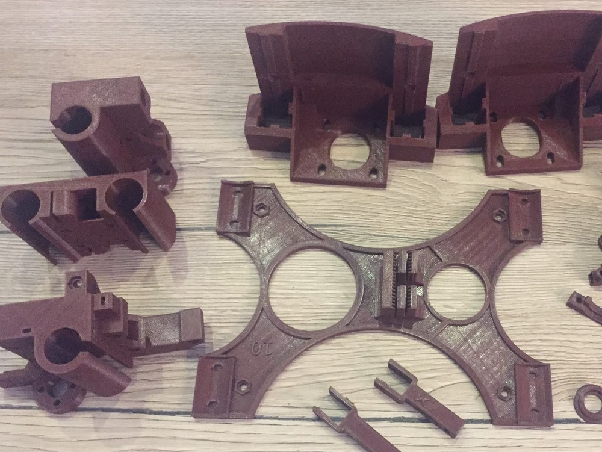

I've been playing with the idea of building a 3D printer for a while. Two months ago I stumbled upon this one model called **Wilson II** from a guy named mrice. It looked pretty straightforward and he had put up videos on YouTube that showed how to assemble the printer.
I decided to finally take the risk and buy the printer. This was the moment where I should have realized that you don't just *buy* the parts to assemble your printer – But I didn't.

There is literally no comprehensive documentation on the topic and even though the [RepRap-Wiki](http://reprap.org/) saved me a few times from giving up, I was almost at the point where I would say **fuck-it**. Fortunately I didn't and eventually a few guys on the #reprap-IRC helped me out and pointed me to a nice list of parts I needed to buy in order to get the printing going.

*Bill of Materials of the Reprap Wilson II – incomplete*

Now you have to know that buying all those parts isn't as easy as going on Amazon and put the stuff into your basket. In fact you probably wouldn't even find half of the listed parts there.

> RepRap is humanity's first general-purpose self-replicating manufacturing machine.

..at least that is what they say on the RepRap project page. And they are right in a way since you **can** self-replicate a lot of parts with a 3d-printer, but the biggest chunk are materials that you need to buy still because they are unprintable.

Now back to my story. Of course I did what I just told you not to do and tried to source all my parts on Amazon and Ebay – bad idea. I ended up with 70% of the materials on the list and was at a price point way to high for a lowly student. The total cost at this point would have been **around 850€**.

Once again I went on the IRC channel to complain – all the people there seemed to still be happy about their purchase even though they must have spent thousands on the stuff they where showing off. This is where I learned about a site called [Aliexpress](http://aliexpress.com). Buying from there is basically buying from the source instead of intermediaries. And in fact I saw a lot of the parts there that I had previously picked out on Ebay that were way cheaper on Aliexpress.

I started sourcing all the pieces from there with a few exceptions – I'll elaborate on that in a moment – and a few days later I had a nice Google Sheet with all the parts I needed to buy.
For anyone interested and in search for a comprehensive list in order to build the Wilson II, here is the link to the sheet: [RepRap Wilson II](https://docs.google.com/spreadsheets/d/1kI-1lE4GC9MqIZvxjbZlEe3kBZOYJa4L2h2OIP9b9GI/edit?usp=sharing).

You might notice that there are some parts I bought from different shops. This is where we get back to the few exceptions I mentioned:

1. Don't buy heavy materials on Aliexpress, the shipping is way to high for those. I went with a local shop on Ebay for the **Aluminium Extrusion** because of that.
2. Precision parts probably have worse quality on Aliexpress. There are tons of fakes and most of the times this isn't an issue. However very crucial parts of your printer need to have high quality manufacturing. I would recommend to **buy your Hotend** from an original supplier for that reason.
I went with the [E3D v6 Lite](http://e3d-online.com/Lite6-1.75mm-Bowden).
3. Get the 3d printed parts from someone local. That way you can ensure quality prints and you also support other people with 3d printers. I did this by searching for a local supplier with good ratings on [3D Hubs](https://www.3dhubs.com/) and bought the parts from there. It is easy enough to do, just upload the parts you need in the `.stl`-Format (for the Wilson II the files can be found [here](https://github.com/mjrice/Wilson2))

With those exceptions in mind I had a great bill of materials I could work with. I also tried to source some parts myself like the **glass for the heatbed**. Of course you could buy expensive borosilicate glass since it is more rigid and won't shatter that easily, but for a first 3d printing experience I figured using cheap picture frame glass was good enough.
That way the complete project **cost me about 400€ now.**

That was a great improvement to the Amazon/Ebay price and I sacrificed almost nothing in terms of quality. Also keep in mind that most orders on Aliexpress come in bigger quantities than you will actually use. That way you are going to have a **lot** of spare parts for your printer and future projects.

This was Part 1 of me building a 3D printer. Next week we are going to have a look at the parts I did (and didn't) receive. You can check it out [here](http://blog.rphl.io/building-the-wilson-II_part2).
