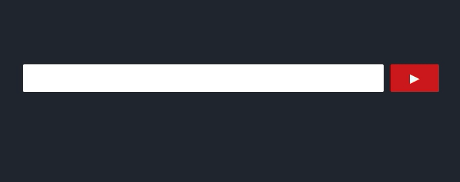

I always hated the clunky pieces of software that call themselves *Youtube Downloader*. They look terrible, are a pain to use, littered with ads and just in general not a nice experience.

As a big fan of selfhosting I wanted something that was under my control. [Docker](https://www.docker.com/what-docker) is a perfect solution for an isolated problem like a Youtube Downloader, but after some research I realized that there was no such thing for Docker yet (Okey, there was no **good** one). I was really excited because this seemed like a nice opportunity to finally stress my homeserver a bit. Up to this point it was basically converting electricity to heat at terrible efficiency. The coding was done using **react** for the frontend and a **hapi**-webserver in the backend *(You gotta love Node.js)*.

Since everything on my homeserver is running in an isolated Docker-Container, the `ytdl-webserver` *(thats what I will call this from now on)* needed a `Dockerfile`. Those are extremely easy to set up and it still blows my mind how much it abstracts from the complicated matter of an OS. I will show you mine:

```docker
# Dockerfile for ytdl-webserver

FROM ubuntu:16.04

RUN apt-get update
RUN apt-get install -y curl
RUN curl -sL https://deb.nodesource.com/setup_6.x | bash -
RUN apt-get install -y nodejs
RUN apt-get install -y ffmpeg
RUN apt-get install -y youtube-dl

RUN mkdir -p /home/app
WORKDIR /home/app
RUN mkdir -p public/temp

COPY . /home/app
RUN npm install
RUN npm run build

EXPOSE 3000
CMD [ "npm", "start" ]
```

Isn't that amazing? You build an image from this file and have an application that can run **everywhere** without having to know **anything** about the underlying OS? **What a time to be alive!**


## 2 What does it do
tldr; Watch the GIF down below{.notice .notice--info}

At the moment the application takes a link from a YouTube video as an input. Then the video gets downloaded with the popular command line tool [youtube-dl](https://rg3.github.io/youtube-dl/). Once it is finished it gets converted to an MP3. Note that I plan on adding other options here like downloading the video without converting, converting it to different formats, etc.

Functionality like that is easy to implement with the current structure, so if you enjoy coding as much as I do, head over to the [project page](https://github.com/Algram/ytdl-webserver) and **contribute**.

I also added some kind of web storage caching for the already downloaded videos and tried to keep everything as consistent as possible. The project is far from finished though, so give it some love.




## 3 Using it
The appliation is super easy to get going. Everything runs with Node.js, so installing is a matter of one line. Since the GitHub-Repo also includes the `Dockerfile` you can even build your own image and host it wherever you want!

```bash
# Run the application locally
npm install && npm start

# Build a docker-image and run it anywhere
docker build -t <your username>/ytdl-webserver .
docker run -p 3000:3000 -d <your username>/ytdl-webserver
```

I hope this article deemed useful to someone who can now selfhost their own Youtube Downloader. The GitHub-Repo for the project [can be found here.](https://github.com/Algram/ytdl-webserver) If you have any questions, open up an issue over there or write me!
