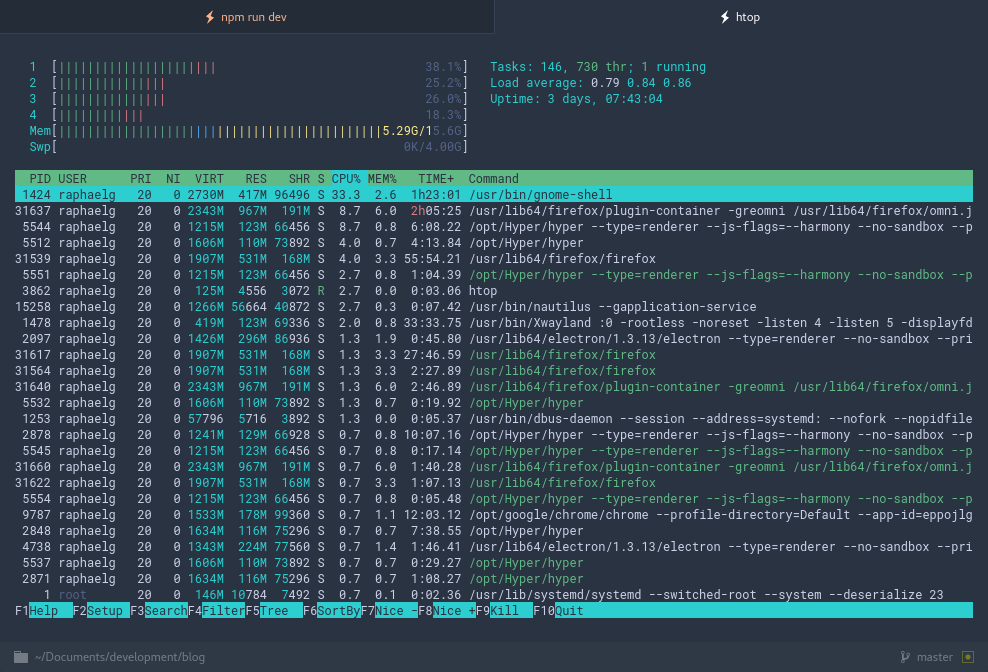

In this post I will show you my current **Hyper** terminal setup. It combines some useful plugins with awesome themes and some custom css styling.



[Hyper](https://hyper.is/) itself is fairly new in the terminal emulator market, but it is definitely the prettiest. Since it is written in Electron (basically HTML and Javascript) it can be slow sometimes. Overall I would still say it is well worth it though.


## 2 The config
<p class="notice notice--info">If you just want to check out my config then you find it <a href="https://github.com/Algram/dotfiles/blob/master/.hyper.js">here</a>.</p>

In the follwing I will go over the changes I made to the default config to perfectly adapt Hyper to my needs. To configure it you need to change the `.hyper.js`-File that lies in your home directory.

First I changed to font to Roboto Mono because I think it works very well. In fact even the syntax highlighting in this blog post is using Roboto Mono.
```javascript
fontFamily: '"Roboto Mono", monospace'
```

Next there are the plugins I use in Hyper.
```javascript
plugins: [
  'hyper-statusline',
  'hyperterm-chesterish',
  'hypercwd',
  'hyper-dark-scrollbar'
]
```
 - `hyper-statusline` Adds information about the current directory like git-branch and folder name on the bottom of the terminal
 - `hyperterm-chesterish` A gorgeous theme for hyper
 - `hypercwd` New tabs open in the same directory as the last tab
 - `hyper-dark-scrollbar` ← What it says

 If you want to get helpful plugins, check out the [Awesome Hyper GitHub Repo](https://github.com/bnb/awesome-hyper).

 ## 3 Optional
 If you want your Hyper to look exactly like in the screenshot at the top you will also have to add some custom styling to the config. This basically removes the top bar with the window controls (Remember you will only be able to move the window around with the keyboard).

```javascript
// Custom CSS to remove header/window-controls and adjust styling
css: `
  .terms_19b1ydh {
    margin-top: 20px;
  }
  .header_windowHeader {
    display: none;
  }
  .tabs_nav {
    top: 0;
  }
  .terms_terms {
    margin-top: 0;
  }
  .terms_termsShifted {
    margin-top: 30px;
  }
`
```

I hope this post was helpful for some of you. If you have some awesome Hyper suggestions yourself, feel free to leave a comment on my new comment engine *powered by GitHub*.
